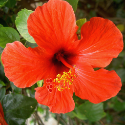

= T.P Découverte de Python
:last-update-label!:
:source-highlighter: pygments
:pygments-style: monokai
:linkattrs:
:toc: left
:icons: font
:stem: latexmath

== Mise en place

Dans le dossier Documents, créer un dossier à votre nom.

WARNING: Tous les fichiers manipulés dans ce T.P doivent être enregistrés dans
ce dossier.

Lancer l'application Anaconda-navigator.

NOTE: Charger cette application peut prendre un peu de temps, soyez patients.

Depuis Anaconda, lancer l'application spyder.

image::assets/lancer_spyder.gif[lancer_spyder,width=450]

Enregistrer le document ouvert sous le nom de tp_11.py dans votre répertoire.

image::assets/sauver_py.gif[sauver_py,width=600]

Spyder devrait présenter deux zones, une zone d'édition de texte qui va
permettre d'écrire dans le fichier ouvert.

Et une zone console que nous allons découvrir.

image::assets/zones.png[zones,width=600]

== Découvrir la console

La console va permettre d'entrer de brèves instructions que la machine
exécutera directement.

image::assets/console.gif[console,width=600]

A l'aide de la console Python de Spyder, effectuer les calculs suivants:
(Les principales opérations sur les nombres en Python sont donnés dans un tableau
juste en dessous)

. stem:[3 \times 2 + 5]
. stem:[-4(2 + 7)]
. stem:[17^2]
. stem:[2^{10}]
. stem:[\frac{5}{2}]
. stem:[2,5 + 12,125]

NOTE: Le nombre 2,5 se note 2.5 en Python.

.Les principales opérations sur les nombres en Python:
|===
| x + y | somme de x et y

| x - y
| différence entre x et y

| x * y
| produit de x par y

| x / y
| quotient de x par y

| x ** y
| x puissance y

| x // y
| quotient de la division euclidienne de x par y

| x % y
| reste de la division euclidienne de x par y
|===

== Un programme de calcul

[source,python]
----
x = 3
x = 2 * x + 1
x = x ** 2
----

Copier/coller le programme de calcul ci-dessus, puis l'exécuter (cliquer sur
    la flèche verte):

image::assets/run.gif[run,width=400]

L'ordinateur a effectué plusieurs calculs qu'il a stocké dans la variable x.
Entrer x dans la console pour voir s'afficher le contenu de x.

image::assets/variable_console.gif[variable_console,width=400]

== Première fonction

Créer un nouveau fichier et le sauvegarder dans votre répertoire au nom
de tp_12.py

image::assets/new_file.gif[new_file, width=600]

Pour créer une fonction en Python, on utilise la syntaxe suivante:

[source,python]
----
def nom_fonction(param1, param2, param3):
    instruction
    ...
    instruction
    return valeur
----

Les instructions dans la fonction sont décalées vers la droite, on parle
d'indentation. C'est ce qui permet à l'interpréteur de comprendre que ces
instructions sont dans la fonction.

Copier-coller le code de la fonction suivante dans le fichier tp_12.py, puis
exécuter le code:

[source,python]
----
def moyenne(x, y):
    m = (x + y) / 2
    return m
----

On peut désormais utiliser la fonction moyenne dans la console. Pour
utiliser la fonction il suffit d'entrer son nom avec les valeurs correspondantes.

image::assets/appel_fonction.gif[appel_fonction, width=700]

. Utiliser la fonction _moyenne_ pour calculer la moyenne de 13 et 19.
. Ecrire une fonction _moyenne_trois_ qui permet de calculer la moyenne de
trois nombres.
Calculer la moyenne de 11, 13 et 17 à l'aide de cette fonction.

== Application au traitement d'images

=== Introduction

Les images en noir et blanc sont en général stocké sous la forme d'un tableau
de nombre, à chaque pixel correspond un nombre.
Le noir correspond à 0, le blanc à 255, les nombres entre les deux à du gris
plus ou moins sombre.

Correspond au fichier:

[source,pgm]
----
P2
# Affiche le mot "L L"
12 7
255
0   0   0   0   0   0   0   0   0   0   0   0
0 100   0   0   0   0   0 200   0   0   0   0
0 100   0   0   0   0   0 200   0   0   0   0
0 100   0   0   0   0   0 200   0   0   0   0
0 100   0   0   0   0   0 200   0   0   0   0
0 100 100 100   0   0   0 200 200 200   0   0
0   0   0   0   0   0   0   0   0   0   0   0
----

Autre illustration:

image::http://images.math.cnrs.fr/IMG/png/section1-original-zoom.png[autre_exemple,width=500]

Pour les images en couleurs, à chaque pixel va correspondre trois nombres,
le code RVB (rouge, vert, bleu) de la couleur du pixel.

=== Convertir une image couleur en noir et blanc

Télécharger l'image de fleur ci-dessous dans votre dossier.
(Clic droit, enregistrer sous..)

link:assets/imgll.py[Télécharger ce fichier, imgll.py] dans votre dossier.

Vérifier que les deux fichiers que vous venez de télécharger se trouve bien
dans votre dossier.

Ajouter tout en haut de votre code dans le fichier tp_12.py, la ligne
ci-dessous:

[source,python]
----
from imgll import appliquer_fonction
----

Cela va nous permettre d'appliquer une fonction à chaque pixel d'une image, de
la sorte:

[source,python]
----
appliquer_fonction(la_fonction,"nom_image")
----

Tester l'exemple suivant:

[source,python]
----
appliquer_fonction(moyenne_trois,"fleur.png")
----

Aller voir dans votre dossier, une nouvelle image a été crée, la visionner.

=== Fonction mystere

Ajouter la fonction suivante:

[source,python]
----
def mystere(x):
    return 255 - x
----

Que va faire cette fonction si on l'applique à une image en noir et blanc ?

La tester sur l'image suivante: (à enregistrer)

=== Filtre

Ajouter à votre code la fonction suivante:

[source,python]
----
def filtre_rouge(r,v,b):
    return r,0,0
----

Tester cette fonction sur l'image de fleur.

S'inspirer de la fonction ci-dessus pour écrire
une fonction qui ne garde que la composante verte d'une image.

Tester cette fonction sur l'image de fleur.

=== Conversion de couleur à nouveau

Pour convertir une image couleur en noir et blanc, il n'est pas recommander
d'utiliser la moyenne, mais utiliser la formule suivante:

stem:[0,2126 \times Rouge + 0,7152 \times Vert + 0,0722 \times Bleu]

S'en inspirer pour écrire une nouvelle fonction de conversion.
